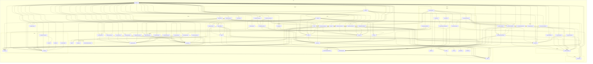

# Dependency Graph

Auto-generated dependency map for `core/`.

Update:
```bash
npm run deps:generate:diagrams
```


```mermaid
flowchart LR

subgraph 0["core"]
subgraph 1["constants"]
2["directional-light-material.js"]
3["ecmascript-types.js"]
4["engine.js"]
5["light.js"]
6["math.js"]
7["mesh.js"]
8["object3d.js"]
9["renderer.js"]
end
subgraph A["controls"]
B["first-person-controls.js"]
J["keyboard-controls.js"]
K["orbit-controls.js"]
L["third-person-controls.js"]
end
subgraph C["scene"]
D["first-person-camera.js"]
G["camera.js"]
H["object3d.js"]
M["third-person-camera.js"]
16["line.js"]
17["mesh.js"]
1K["scene.js"]
1M["perspective-camera.js"]
22["points.js"]
2I["orthographic-camera.js"]
end
subgraph E["math"]
F["matrix4.js"]
I["vector3.js"]
2E["catmull-rom-curve3.js"]
2F["curve3.js"]
2G["path3d.js"]
2H["vector3-math.js"]
end
subgraph N["debug"]
O["fps-counter.js"]
P["light-gizmo.js"]
18["transform-gizmo.js"]
end
subgraph Q["geometry"]
R["polyline-geometry.js"]
S["geometry-utils.js"]
T["geometry.js"]
19["box-geometry.js"]
1A["sphere-geometry.js"]
1N["cone-geometry.js"]
1O["custom-geometry.js"]
1P["heightmap-geometry.js"]
1Q["plane-geometry.js"]
1R["points-geometry.js"]
1S["pyramid-geometry.js"]
1T["torus-geometry.js"]
1U["tube-line-geometry.js"]
end
subgraph U["light"]
V["directional-light.js"]
Y["light.js"]
1H["ambient-light.js"]
end
subgraph W["exception-messages"]
X["light.js"]
1G["renderer.js"]
1J["directional-light-material.js"]
end
subgraph Z["material"]
10["solid-color-material.js"]
15["material.js"]
1D["vertex-color-material.js"]
1I["directional-light-material.js"]
21["points-material.js"]
28["lambert-material.js"]
29["mtl-standard-material.js"]
2A["phong-material.js"]
2C["normal-material.js"]
2D["textured-material.js"]
end
subgraph 11["shader"]
12["shader-program.js"]
end
subgraph 13["texture"]
14["texture2d.js"]
end
subgraph 1B["engine"]
1C["engine.js"]
end
subgraph 1E["render"]
1F["renderer.js"]
end
1L["webgl-context.js"]
subgraph 1V["interaction"]
1W["raycaster.js"]
end
1X["library.js"]
subgraph 1Y["loaders"]
subgraph 1Z["obj-mtl"]
20["obj-mtl-loader.js"]
23["mtl-parser.js"]
24["material-name-normalizer.js"]
25["mtl-texture-cache.js"]
26["obj-geometry-builder.js"]
27["obj-material-factory.js"]
2B["obj-parser.js"]
end
end
end
5-->6
B-->D
B-->H
B-->J
D-->6
D-->F
D-->G
F-->6
G-->6
G-->H
H-->6
H-->8
H-->F
H-->I
I-->6
J-->G
J-->H
K-->I
K-->G
L-->H
L-->M
L-->J
M-->6
M-->F
M-->G
P-->R
P-->V
P-->10
P-->I
P-->16
P-->H
R-->I
R-->S
R-->T
V-->3
V-->5
V-->6
V-->X
V-->Y
Y-->3
Y-->5
Y-->X
Y-->H
10-->12
10-->15
12-->14
15-->12
16-->T
16-->15
16-->17
17-->3
17-->7
17-->T
17-->15
17-->H
18-->19
18-->R
18-->1A
18-->10
18-->I
18-->16
18-->17
18-->H
19-->S
19-->T
1A-->S
1A-->T
1C-->4
1C-->19
1C-->15
1C-->1D
1C-->1F
1C-->G
1C-->17
1C-->1M
1C-->1K
1C-->1L
1D-->12
1D-->15
1F-->6
1F-->9
1F-->1G
1F-->T
1F-->1H
1F-->V
1F-->1I
1F-->F
1F-->G
1F-->17
1F-->H
1F-->1K
1F-->1L
1H-->3
1H-->5
1H-->X
1H-->Y
1I-->2
1I-->3
1I-->5
1I-->1J
1I-->12
1I-->15
1K-->H
1M-->6
1M-->F
1M-->G
1N-->S
1N-->T
1O-->S
1O-->T
1P-->S
1P-->T
1Q-->S
1Q-->T
1R-->I
1R-->S
1R-->T
1S-->S
1S-->T
1T-->S
1T-->T
1U-->I
1U-->S
1U-->T
1W-->F
1W-->G
1W-->17
1W-->1K
1X-->B
1X-->J
1X-->K
1X-->L
1X-->O
1X-->P
1X-->18
1X-->1C
1X-->19
1X-->1N
1X-->1O
1X-->T
1X-->1P
1X-->1Q
1X-->1R
1X-->R
1X-->1S
1X-->1A
1X-->1T
1X-->1U
1X-->1W
1X-->1H
1X-->V
1X-->Y
1X-->20
1X-->1I
1X-->28
1X-->15
1X-->29
1X-->2C
1X-->2A
1X-->21
1X-->10
1X-->2D
1X-->1D
1X-->2E
1X-->2F
1X-->F
1X-->2G
1X-->2H
1X-->I
1X-->1F
1X-->G
1X-->D
1X-->16
1X-->17
1X-->H
1X-->2I
1X-->1M
1X-->22
1X-->1K
1X-->M
1X-->12
1X-->14
1X-->1L
20-->3
20-->21
20-->10
20-->16
20-->17
20-->22
20-->23
20-->25
20-->26
20-->27
20-->2B
21-->12
21-->15
22-->T
22-->15
22-->17
23-->3
23-->24
24-->3
25-->3
25-->14
26-->3
26-->1O
26-->1R
26-->R
26-->I
26-->H
27-->3
27-->28
27-->29
27-->2A
27-->1D
27-->25
28-->2
28-->12
28-->1I
29-->2
29-->3
29-->12
29-->14
29-->1I
2A-->2
2A-->12
2A-->1I
2B-->3
2B-->24
2C-->12
2C-->15
2D-->12
2D-->14
2D-->15
2E-->2F
2E-->I
2F-->I
2G-->I
2H-->I
2I-->6
2I-->F
2I-->G
```
